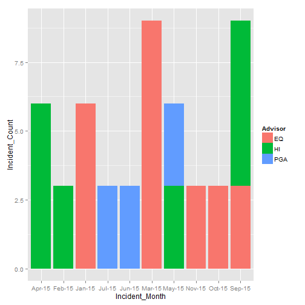
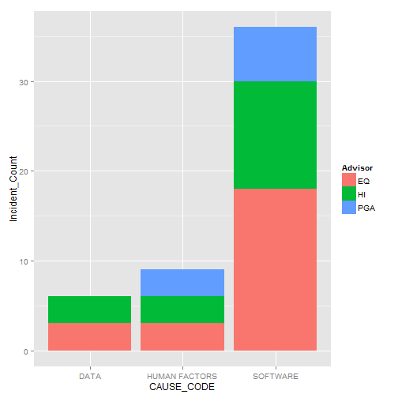

Customer Incident Update
========================================================
author: Melabraham
date: Sat Feb 21 14:28:50 2015

Incidents reported by the customer for the software products
========================================================

### View of the incidents 

- Summary of all the incidents till date
- Plot of the number of incidents per month by advisor
- Plot of the number of Incidents by root cause for advisor
- Appendix
-- List of all the incidents till date

Summary of the incidents  
========================================================


```
 ADVISOR  PRODUCT      SEVERITY             CAUSE_CODE
 EQ :24   EWS :12   Min.   :2.000   DATA         : 6  
 HI :18   PATS:12   1st Qu.:3.000   HUMAN FACTORS: 9  
 PGA: 9   PMWS:27   Median :4.000   SOFTWARE     :36  
                    Mean   :3.588                     
                    3rd Qu.:4.000                     
                    Max.   :4.000                     
                                                      
             RESOLUTION_CODE
 ADMINISTRATION      :12    
 CONFIGURATION       : 9    
 CODE CHANGE REQUIRED: 6    
 NO ACTION TAKEN     : 3    
 PROVIDED STATUS     : 3    
 RECYCLED APPLICATION: 3    
 (Other)             :15    
```

Plot of number of incidents per month by advisor
========================================================

 
Plot of number of Incidents by root cause for advisor
========================================================

 
Appendix  
========================================================

List of all the incidents  
========================================================


```
   INCIDENT_MONTH ADVISOR PRODUCT SEVERITY    CAUSE_CODE
1          Jan-15      EQ    PATS        2      SOFTWARE
2          Mar-15      EQ    PATS        3      SOFTWARE
3          Mar-15      EQ    PATS        3      SOFTWARE
4          Mar-15      EQ    PATS        4      SOFTWARE
5          Apr-15      HI     EWS        3      SOFTWARE
6          Apr-15      HI     EWS        3 HUMAN FACTORS
7          May-15      HI     EWS        4          DATA
8          May-15     PGA     EWS        4      SOFTWARE
9          Jun-15     PGA    PMWS        4 HUMAN FACTORS
10         Jul-15     PGA    PMWS        4      SOFTWARE
11         Sep-15      HI    PMWS        4      SOFTWARE
12         Sep-15      HI    PMWS        4      SOFTWARE
13         Sep-15      EQ    PMWS        3      SOFTWARE
14         Oct-15      EQ    PMWS        4 HUMAN FACTORS
15         Nov-15      EQ    PMWS        4      SOFTWARE
16         Jan-15      EQ    PMWS        4          DATA
17         Feb-15      HI    PMWS        4      SOFTWARE
18         Jan-15      EQ    PATS        2      SOFTWARE
19         Mar-15      EQ    PATS        3      SOFTWARE
20         Mar-15      EQ    PATS        3      SOFTWARE
21         Mar-15      EQ    PATS        4      SOFTWARE
22         Apr-15      HI     EWS        3      SOFTWARE
23         Apr-15      HI     EWS        3 HUMAN FACTORS
24         May-15      HI     EWS        4          DATA
25         May-15     PGA     EWS        4      SOFTWARE
26         Jun-15     PGA    PMWS        4 HUMAN FACTORS
27         Jul-15     PGA    PMWS        4      SOFTWARE
28         Sep-15      HI    PMWS        4      SOFTWARE
29         Sep-15      HI    PMWS        4      SOFTWARE
30         Sep-15      EQ    PMWS        3      SOFTWARE
31         Oct-15      EQ    PMWS        4 HUMAN FACTORS
32         Nov-15      EQ    PMWS        4      SOFTWARE
33         Jan-15      EQ    PMWS        4          DATA
34         Feb-15      HI    PMWS        4      SOFTWARE
35         Jan-15      EQ    PATS        2      SOFTWARE
36         Mar-15      EQ    PATS        3      SOFTWARE
37         Mar-15      EQ    PATS        3      SOFTWARE
38         Mar-15      EQ    PATS        4      SOFTWARE
39         Apr-15      HI     EWS        3      SOFTWARE
40         Apr-15      HI     EWS        3 HUMAN FACTORS
41         May-15      HI     EWS        4          DATA
42         May-15     PGA     EWS        4      SOFTWARE
43         Jun-15     PGA    PMWS        4 HUMAN FACTORS
44         Jul-15     PGA    PMWS        4      SOFTWARE
45         Sep-15      HI    PMWS        4      SOFTWARE
46         Sep-15      HI    PMWS        4      SOFTWARE
47         Sep-15      EQ    PMWS        3      SOFTWARE
48         Oct-15      EQ    PMWS        4 HUMAN FACTORS
49         Nov-15      EQ    PMWS        4      SOFTWARE
50         Jan-15      EQ    PMWS        4          DATA
51         Feb-15      HI    PMWS        4      SOFTWARE
          RESOLUTION_CODE
1    CODE CHANGE REQUIRED
2      ROUTINE RESOLUTION
3       RECYCLED HARDWARE
4    CODE CHANGE REQUIRED
5           CONFIGURATION
6      RECYCLED WEBSERVER
7           CONFIGURATION
8          ADMINISTRATION
9          ADMINISTRATION
10         ADMINISTRATION
11   RECYCLED APPLICATION
12        NO ACTION TAKEN
13            REPROCESSED
14        PROVIDED STATUS
15          CONFIGURATION
16 RESOLVED BY AUTOMATION
17         ADMINISTRATION
18   CODE CHANGE REQUIRED
19     ROUTINE RESOLUTION
20      RECYCLED HARDWARE
21   CODE CHANGE REQUIRED
22          CONFIGURATION
23     RECYCLED WEBSERVER
24          CONFIGURATION
25         ADMINISTRATION
26         ADMINISTRATION
27         ADMINISTRATION
28   RECYCLED APPLICATION
29        NO ACTION TAKEN
30            REPROCESSED
31        PROVIDED STATUS
32          CONFIGURATION
33 RESOLVED BY AUTOMATION
34         ADMINISTRATION
35   CODE CHANGE REQUIRED
36     ROUTINE RESOLUTION
37      RECYCLED HARDWARE
38   CODE CHANGE REQUIRED
39          CONFIGURATION
40     RECYCLED WEBSERVER
41          CONFIGURATION
42         ADMINISTRATION
43         ADMINISTRATION
44         ADMINISTRATION
45   RECYCLED APPLICATION
46        NO ACTION TAKEN
47            REPROCESSED
48        PROVIDED STATUS
49          CONFIGURATION
50 RESOLVED BY AUTOMATION
51         ADMINISTRATION
```
